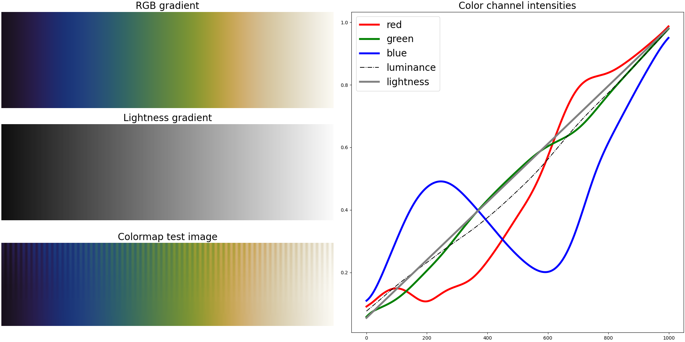
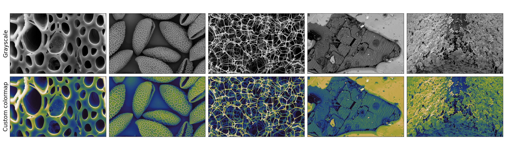
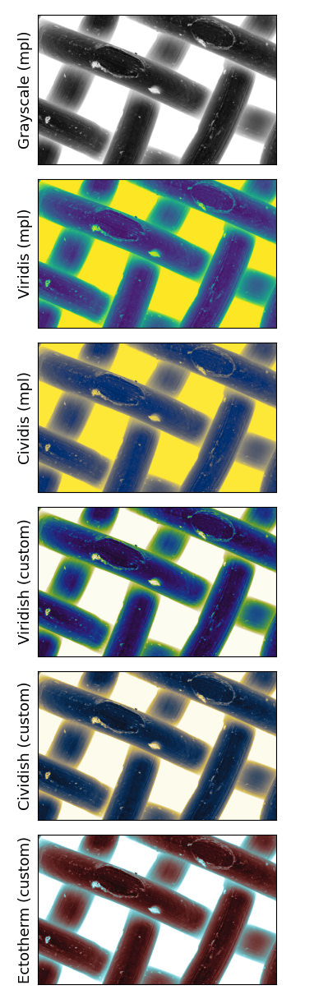
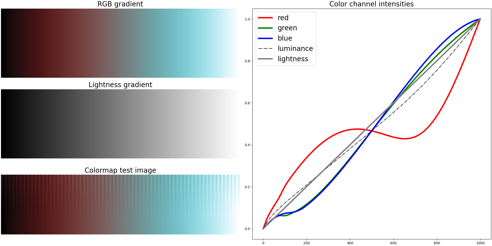
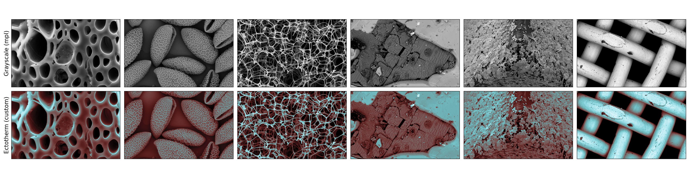

# perfect-cmaps
This repository provides Python functionality for creating custom colormaps which are perfectly perceptually uniform.
The project came up as a result of there being too few easily accessible perceptually uniform colormaps, so I wanted to have a go at creating a good library where users can easily create their own. I wasn't quite happy with colormaps such as `viridis`, `plasma` or `magma` from `matplotlib`, so I started making some algorithmic colormaps. 

To stay as true as possible to the lightness achieved by a true grayscale colormap, but add more information with colors, the perceptual range of colormaps is optimized to be as high as possible.

### Here's an example of creating a custom colormap:

https://github.com/user-attachments/assets/a63d0c31-d799-49d0-a2cd-30c0b423378f

### The final colormap looks like this:

### Test images 

Here's a compilation of some colormaps generated with this library, compared with some standard colormaps available in `matplotlib`.:

The top two colormaps, `viridis` and `cividis` have a lower perceptual range, and thus look less clear -- almost like there's a filter on them. The colormaps generated with this library are crisper and offer a maximal perceptual range. Additionally, the perceptual limitation for the standard colormaps is especially visible when for example a background in grayscale is very white, in which case the standard colormaps are in this case yellow and clearly do not cover the entire lightness spectrum.

The algorithmically created `ectotherm` colormap in fact covers 100 % of the perceptual range, while adding more information through colors. It ranges from completely black to completely white, while adding colors in between and maintaining truly linearly increasing lightness. This is one of my favorites! The other two displayed custom colormaps mimic `viridis` and `cividis`, but with a higher perceptual range.

Thanks to *Nanoscience.com* for letting me use these images as examples! Find them at https://www.nanoscience.com/techniques/scanning-electron-microscopy/.

These custom generated colormaps are theoretically perceptually uniform, but note that some screen settings may show colormap artifacts, making the colormaps appear less perceptually uniform. This may happen at lower lighting, for example.
